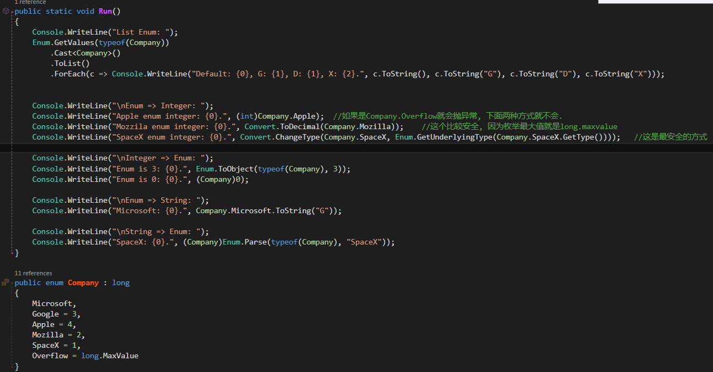
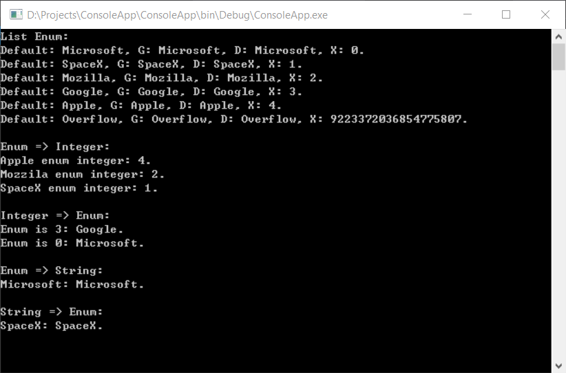

### 3.1.4 �����ʼ����

Ϊ�˼�������ʼ��, �����ڵ��ù��췽���������ֱ�ӳ�ʼ������Ŀɷ����ֶλ�����. �����������:

	public class Bunny
	{
		public string Name;
		public bool LikesCarrots;
		public bool LikesHumans;

		public Bunny(){}
		public Bunny(string n){ Name = n; }
	}

�ó�ʼ������ʼ������ķ�������:

	Bunny b1 = new Bunny{Name = "Bo", LikesCarrots = true, LikesHumans = false};
	Bunny b2 = new Bunny("Bo") { LikesCarrots = true, LikesHumans = false };

����Ĵ����ͬ��:

	Bunny temp1 = new Bunny();	//temp1 �DZ��������ɵ�����
	temp1.Name = "Bo";
	temp1.LikesCarrots = true;
	temp1.LikesHumans = false;
	Bunny b1 = temp1;

	Bunny temp2 = new Bunny("Bo");
	temp2.LikesCarrots = true;
	temp2.LikesHumans = false;
	Bunny b2 = temp2;

ʹ����ʱ������Ϊ��ȷ���ڳ�ʼ������������׳��쳣, ����õ�һ����ʼ��δ��ɵĶ���.

������ö����ʼ����, Ҳ������Bunny��Ĺ��췽�����ܿ�ѡ����:

	public Bunny(string name, bool likesCarrots = false, bool likesHumans = false)
	{
		Name = name;
		LikesCarrots = likesCarrots;
		LikesHumans = likesHumans;
	}

���������ŵ������ǿ�������Bunny���ֶκ�����Ϊֻ����(Note: ��������� `public string Name{get; private set;}`). ȱ�������еĿ�ѡ�������ڵ��÷�����, Ҳ����˵���´���:

	Bunny b1 = new Bunny(name: "Bo", likesCarrots: true);

IL��������:

	Bunny b1 = new Bunny("Bo", true, false);

��ʹ���������һ��������ʵ����Bunny��, ����Bunny���ټ�һ����ѡ����(�� `likesCats`)�ǿ��ܳ���. �������ø���ij���Ҳ���±���, ���������������������������Ĺ��췽��(�����Ѿ�������), ����������ʱ����. ����һ�����Է��ֵĴ�����, ��������޸���ij����ѡ������Ĭ��ֵ, ��һ�����򼯵ĵ��÷������±���ǰ, �������ʹ�þɵĿ�ѡֵ. ���, �������ʹ�����ڲ�ͬ�汾�ij����б��ֶ����Ƶļ���, ��ñ����ڹ��з�����ʹ�ÿ�ѡ����.

Note: �����ᵽ�Ŀ�ѡ����������, ʵ�����ǿ�ѡ��������﷨�ǵ�����, ��ѡ����ֻ�DZ�����ʵ�ֵ��﷨��, ��IL������û�п�ѡ����������Ե�, ����������ѡ���������п��ܶ�д����dll����.

### 3.1.9 ��̬���췽��

����������Ϊ���Դ�����̬���췽��:
1. ʵ������
2. ������ľ�̬��Ա

��̬�ֶ��ڵ��þ�̬���췽��֮ǰִ�г�ʼ��.

��̬�ֶΰ��ֶ��������Ⱥ�˳���ʼ��, ����Ĵ��� X ��ʼ��Ϊ0, Y ��ʼ��Ϊ3.

	class Foo
	{
		public static int X = Y;		//0
		public static int Y = 3;		//3
	}

������ǵ��������ֶεij�ʼ��˳��, �����ֶζ�������ʼ��Ϊ3. �������ȴ�ӡ0���ӡ3, ��Ϊ�ֶγ�ʼ������X����ʼ��Ϊ3Ǯʵ����Foo:

	class Program
	{
	    static void Main(string[] args)
	    {
	        Console.WriteLine(Foo.X);		//3
	        Console.ReadKey();
	    }
	}
	
	
	
	public class Foo
	{
	    public static Foo Instance = new Foo();
	    public static int X = 3;
	    public Foo()
	    {
	        Console.WriteLine(X);		//0
	    }
	}
	
### 3.2.8 ������̳�

**Note: ���캯���Dz��ᱻ�̳е�. ��һ������(����`Sub`)�̳и���(����`Parent`)ʱ, ���Sub�����ⲿ����ʵ����(Ҳ�����ɹ������캯��), Sub�����ܷ��ʵ�Parent�е�����һ�����캯��(Ҳ����˵Paren�����й��캯����, ����Ĭ�ϵ��޲ι��캯��, ������һ����public����protected, ���Sub��Parent��ͬһ�����򼯻�������internal.), �Ա�Subʵ����ʱҲ�ܹ�ʵ����Parent. Ĭ�������ʵ����Subʱ, ���Զ�����Parent���޲ι��캯��. ���Parentû���޲ι��캯��, Sub�Ĺ��캯��������ʾ����`base(...)`��ִ��Parent��ʵ����. **

ʾ��1: 

	public class Parent { private Parent() {} }
	public class Sub : Parent { public Sub() {} }

ʾ��2: 

	public class Parent { private Parent(){} public Parent(string n){} }
	public class Sub : Parent { public Sub(){} }

ʾ��3: 

	public class Parent { private Parent(){} public Parent(string n){} }
	public class Sub : Parent { public Sub() {} public Sub(string n):base(n){} }

ʾ��4:

	pulic class Parent { }
	pulic class Sub { }

ʾ��5: 

	public class Parent { private Parent(){} public Parent(string n){} }
	public class Sub : Parent { public Sub():base("value"){} public Sub(string n):base(n){} }

**ʾ��1, 2, 3���Ǵ����, ʾ��4, 5����ȷ��. ���е�4��SubĬ�ϻ����Parent���޲ι��캯��. һ�������������б����ǿ�ʵ������, һ��������ʵ����ʱҲ����ʵ��������.**

��һ������̳и���ʱ, ������ʵ����ʱ, ���캯�����ֶεij�ʼ��˳��:

1. ��ʼ��������ֶ�
2. ������ֶ�����
3. ����Ĺ��캯��
4. ����Ĺ��캯��

### 3.3.1 װ��Ͳ���

����ͷ��͵ı���ֻ��֧������ת��, ����֧��װ��ת��:

	object [] a1 = new string [3];	//�Ϸ�
	object [] a2 = new int [3];		//����

### 3.4 �ṹ��

���� �޲����Ĺ��췽��(Note: �����岻���ֶ�����һ���޲ι��췽��), ��ֹ��(Finialize), ���Ա ��, �ṹ�����ӵ��������г�Ա.
�ṹ�岻�ܼ̳�.
����ṹ��ķ���ʱ, ������ʾָ��ÿ���ֶ�.
�����ڽṹ�����ʼ���ֶ�.(Note: �������ڶ����ֶε�ͬʱ���ֶθ�ֵ)

### 6.1.1 char

	char.IsLetter('a')		//true
	char.IsUpper('A')		//true
	char.IsLower('b')		//true
	char.IsDigit('3')		//true
	char.IsLettterOrDigit('a') //true
	char.IsNumber

	char.GetUnicodeCategory('\n')	//Control

### 6.1.2 string

	new string("-", 5);	// -----
	"pas5w0rd".IndexOfAny("0123456789".ToCharArray())	//3

### 6.8 Enum

