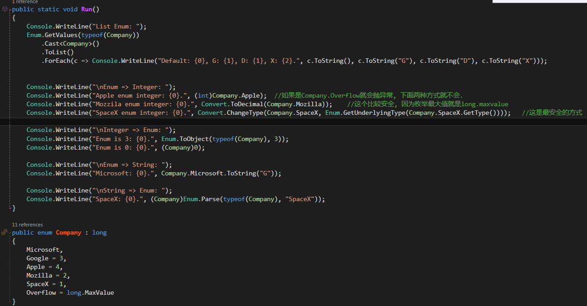
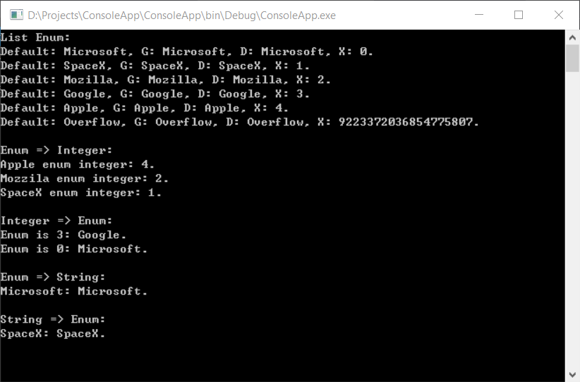

### 3.1.4 对象初始化器

为了简化类对象初始化, 可以在调用构造方法的语句中直接初始化对象的可访问字段或属性. 例如下面的类:

	public class Bunny
	{
		public string Name;
		public bool LikesCarrots;
		public bool LikesHumans;

		public Bunny(){}
		public Bunny(string n){ Name = n; }
	}

用初始化器初始化对象的方法如下:

	Bunny b1 = new Bunny{Name = "Bo", LikesCarrots = true, LikesHumans = false};
	Bunny b2 = new Bunny("Bo") { LikesCarrots = true, LikesHumans = false };

上面的代码等同于:

	Bunny temp1 = new Bunny();	//temp1 是编译期生成的名字
	temp1.Name = "Bo";
	temp1.LikesCarrots = true;
	temp1.LikesHumans = false;
	Bunny b1 = temp1;

	Bunny temp2 = new Bunny("Bo");
	temp2.LikesCarrots = true;
	temp2.LikesHumans = false;
	Bunny b2 = temp2;

使用临时变量是为了确保在初始化过程中如果抛出异常, 不会得到一个初始化未完成的对象.

如果不用对象初始化器, 也可以让Bunny类的构造方法接受可选参数:

	public Bunny(string name, bool likesCarrots = false, bool likesHumans = false)
	{
		Name = name;
		LikesCarrots = likesCarrots;
		LikesHumans = likesHumans;
	}

这样做的优点是我们刻意设置Bunny的字段和属性为只读的(Note: 大概类似于 `public string Name{get; private set;}`). 缺点是所有的可选参数都在调用方处理, 也就是说如下代码:

	Bunny b1 = new Bunny(name: "Bo", likesCarrots: true);

IL翻译如下:

	Bunny b1 = new Bunny("Bo", true, false);

这使得如果在另一个程序集中实例化Bunny类, 而当Bunny类再加一个可选参数(如 `likesCats`)是可能出错. 除非引用该类的程序集也重新编译, 否则它还将继续调用三个参数的构造方法(现在已经不存在), 并出现运行时错误. 还有一种难以发现的错误是, 如果我们修改了某个可选参数的默认值, 另一个程序集的调用方在重新编译前, 还会继续使用旧的可选值. 因此, 如果想在使程序在不同版本的程序集中保持二进制的兼容, 最好避免在公有方法中使用可选参数.

Note: 上面提到的可选参数的问题, 实际上是可选参数这个语法糖的问题, 可选参数只是编译器实现的语法糖, 在IL级别是没有可选参数这个特性的, 编译器将可选参数的所有可能都写死在dll里了.

### 3.1.9 静态构造方法

以下两种行为可以触发静态构造方法:
1. 实例化类
2. 访问类的静态成员

静态字段在调用静态构造方法之前执行初始化.

静态字段按字段声明的先后顺序初始化, 下面的代码 X 初始化为0, Y 初始化为3.

	class Foo
	{
		public static int X = Y;		//0
		public static int Y = 3;		//3
	}

如果我们调换两个字段的初始化顺序, 两个字段都将被初始化为3. 下例中先打印0后打印3, 因为字段初始化器在X被初始化为3钱实例化Foo:

	class Program
	{
	    static void Main(string[] args)
	    {
	        Console.WriteLine(Foo.X);		//3
	        Console.ReadKey();
	    }
	}
	
	
	
	public class Foo
	{
	    public static Foo Instance = new Foo();
	    public static int X = 3;
	    public Foo()
	    {
	        Console.WriteLine(X);		//0
	    }
	}
	
### 3.2.8 构造与继承

**Note: 构造函数是不会被继承的. 当一个子类(比如`Sub`)继承父类(比如`Parent`)时, 如果Sub允许外部调用实例化(也就是由公开构造函数), Sub必须能访问到Parent中的至少一个构造函数(也就是说Paren的所有构造函数中, 包括默认的无参构造函数, 至少有一个是public或者protected, 如果Sub和Parent是同一个程序集还可以是internal.), 以便Sub实例化时也能够实例化Parent. 默认情况下实例化Sub时, 会自动调用Parent的无参构造函数. 如果Parent没有无参构造函数, Sub的构造函数必须显示调用`base(...)`来执行Parent的实例化. **

示例1: 

	public class Parent { private Parent() {} }
	public class Sub : Parent { public Sub() {} }

示例2: 

	public class Parent { private Parent(){} public Parent(string n){} }
	public class Sub : Parent { public Sub(){} }

示例3: 

	public class Parent { private Parent(){} public Parent(string n){} }
	public class Sub : Parent { public Sub() {} public Sub(string n):base(n){} }

示例4:

	pulic class Parent { }
	pulic class Sub { }

示例5: 

	public class Parent { private Parent(){} public Parent(string n){} }
	public class Sub : Parent { public Sub():base("value"){} public Sub(string n):base(n){} }

**示例1, 2, 3都是错误的, 示例4, 5是正确的. 其中第4个Sub默认会调用Parent的无参构造函数. 一个父类在子类中必须是可实例化的, 一个子类在实例化时也必须实例化父类.**

当一个子类继承父类时, 子类在实例化时, 构造函数和字段的初始化顺序:

1. 初始化子类的字段
2. 父类的字段声明
3. 父类的构造函数
4. 子类的构造函数

### 3.3.1 装箱和拆箱

数组和泛型的变量只能支持引用转换, 不能支持装箱转换:

	object [] a1 = new string [3];	//合法
	object [] a2 = new int [3];		//出错

### 3.4 结构体

除了 无参数的构造方法(Note: 构造体不能手动添加一个无参构造方法), 终止器(Finialize), 虚成员 外, 结构体可以拥有类的所有成员.
结构体不能继承.
定义结构体的方法时, 必须显示指定每个字段.
不能在结构体里初始化字段.(Note: 不允许在定义字段的同时给字段赋值)

### 6.1.1 char

	char.IsLetter('a')		//true
	char.IsUpper('A')		//true
	char.IsLower('b')		//true
	char.IsDigit('3')		//true
	char.IsLettterOrDigit('a') //true
	char.IsNumber

	char.GetUnicodeCategory('\n')	//Control

### 6.1.2 string

	new string("-", 5);	// -----
	"pas5w0rd".IndexOfAny("0123456789".ToCharArray())	//3

### 6.8 Enum

