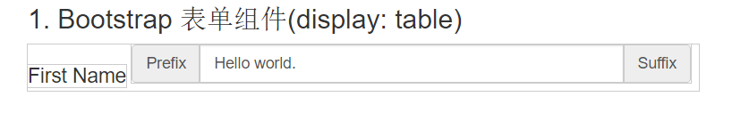
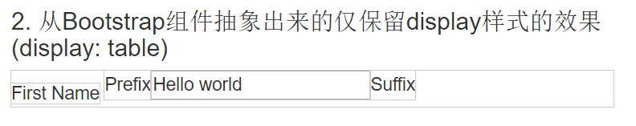
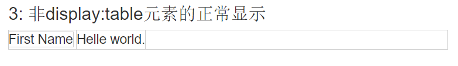

# 关于将元素`display`设置成`table`对兄弟节点的影响(对父节点的兄弟节点的影响)

一个同事遇到一个问题, 在使用Bootstrap的`input-group`组件时, 如果在组件的左边添加文本或者其他内容, 元素在水平线上就无法对齐, `span`元素会比兄弟元素`div`靠下一点:

```xml
<div>
	<span>First Name</span>
	<div style="display: inline-block; width: 500px;">
	    <div class="input-group">
	        <span class="input-group-addon">Prefix</span>
	        <input type="text" class="form-control" value="Hello world." />
	        <span class="input-group-addon">Suffix</span>
	    </div>
	</div>
</div>
```

页面显示效果如下(为了演示在这里给所有的元素都添加了outline样式. 可以直接[在线浏览](http://sandbox.runjs.cn/show/ubmjphtp)或复制文章底部源码自行查看.):

图1


为了防止是Bootstrap某个样式的margin或者padding导致的, 提取了样式信息, 源码代码如下:

```xml
<div>
 <span>First Name</span>
 <div style="display: inline-block;">
     <div style="display: table; ">
         <span style="display: table-cell;">Prefix</span>
         <input style="display: table-cell;" type="text" value="Hello world" />
         <span style="display: table-cell;">Suffix</span>
     </div>
 </div>
</div>
```

页面显示如下:

图2


当时认为两个相邻元素应该在一个水平线上, 就像下面的代码显示的那样:

```xml
<div>
	<span>First Name</span>
	<div style="display: inline-block;">Helle world.</div>
</div>
```

图3


通过Chrome查看图1和图2的Computed样式也没调试出来是那个样式导致的这个细微差异. 后来翻阅资料也没看出来为何, 但是发现一个 `display: inline-table` 的样式, 如果把图2(包括图1)对应代码中的`display: table`改成`display: inline-table`发现就在一个水平线了, 代码如下:

```xml
<div>
    <span>First Name</span>
    <div style="display: inline-block;">
        <div style="display: block; ">Hello world</div>
    </div>
</div>
```
显示效果如下


这个问题之前我也遇到过, 不过通过`float`或者外面再套一层`display:table`, 来矫正这个不在一条水平线上的问题. 可是为什么会导致这样的差异呢? `display`的`block`, `inline-block` 与 `table`, `inline-table` 对元素布局(或者文档流)有哪些影响呢?

NOTE: 在《CSS权威指南》 P347 提到了 `inline-block` 是行内行内级表, 与之最接近的非表值是`inline-block`. 还有就是Bootstrap在构建那个表单组件的时候在`display:table`元素下面直接用`display: table-cell`, 中间并未使用`display: table-row`, 这是因为CSS有一个叫匿名表的特性: 标记语言中可能未包含足够的元素, 以至于无法按CSS的定义充分表示表, CSS可以将"遗漏"的组件作为匿名对象插入, 直白点就是用户代理会帮你插入一个row元素进去. 这跟平时写table, 不写tbody, 直接 table>tr>td 类似.

## 截图演示的全部源码
```xml
<!DOCTYPE html>
<html lang="en">

<head>
    <meta charset="UTF-8">
    <title>CSS</title>
    <link href="https://cdn.bootcss.com/bootstrap/3.3.7/css/bootstrap.css" rel="stylesheet">
    <style type="text/css">
    body>div {
        margin: 0 auto 50px auto;
        width: 600px;
        font-size: 18px;
    }
    
    body>h3 {
        margin: 10px auto;
        width: 600px;
    }
    
    div,
    span,
    input {
        outline: 1px solid #ccc;
        padding: 0;
        margin: 0;
    }
    
    div:hover,
    span:hover,
    input:hover {
        outline: 1px solid #aaa;
    }
    </style>
</head>

<body>
    <h3>1. Bootstrap 表单组件(display: table)</h3>
    <div>
        <span>First Name</span>
        <div style="display: inline-block; width: 500px;">
            <div class="input-group">
                <span class="input-group-addon">Prefix</span>
                <input type="text" class="form-control" value="Hello world." />
                <span class="input-group-addon">Suffix</span>
            </div>
        </div>
    </div>
    <h3>2. 从Bootstrap组件抽象出来的仅保留display样式的效果 (display: table)</h3>
    <div>
        <span>First Name</span>
        <div style="display: inline-block;">
            <div style="display: table; ">
                <span style="display: table-cell;">Prefix</span>
                <input style="display: table-cell;" type="text" value="Hello world" />
                <span style="display: table-cell;">Suffix</span>
            </div>
        </div>
    </div>
    <h3>3: 非display:table元素的正常显示</h3>
    <div>
        <span>First Name</span>
        <div style="display: inline-block;">Helle world.</div>
    </div>
    <h3>4: 利用inline-table校正后的效果(display: inline-table)</h3>
    <div>
        <span>First Name</span>
        <div style="display: inline-block;">
            <div style="display: inline-table; ">
                <span style="display: table-cell;">Prefix</span>
                <input style="display: table-cell;" type="text" value="Hello world" />
                <span style="display: table-cell;">Suffix</span>
            </div>
        </div>
    </div>
</body>

</html>

```