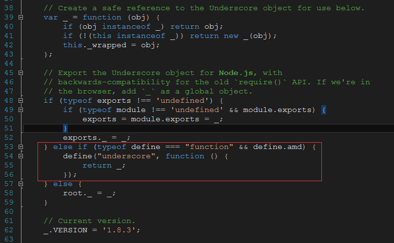

# 将UnderscoreJS集成到RequireJS

UnderscoreJS在1.3.0版本中一处了AMD(RequireJS)的支持. 下面介绍一种简便的方法,让UnderscoreJS支持RequireJS. 下面介绍的是使用 [Underscore.js 1.8.3](../Static/underscore-with-requirejs.js) 版本:

上面的红色圈住的部分就是新增的用于支持RequrieJS的代码.

这个方法来源于[GitHub](https://github.com/jashkenas/underscore/commit/0d4b1247c45083c695cab4242c084a97aa600221), 里面同时指出了[源码的位置](http://underscorejs.org/docs/underscore.html#section-10).

