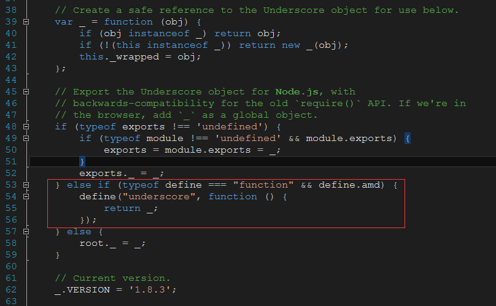

# ��UnderscoreJS���ɵ�RequireJS

UnderscoreJS��1.3.0�汾��һ����AMD(RequireJS)��֧��. �������һ�ּ��ķ���,��UnderscoreJS֧./Resources/JS. ������ܵ���ʹ�� [Underscore.js 1.8.3](../Static/underscore-with-requirejs.js) �汾:

����ĺ�ɫȦס�IJ��־�������������֧��RequrieJS�Ĵ���.

���������Դ��[GitHub](https://github.com/jashkenas/underscore/commit/0d4b1247c45083c695cab4242c084a97aa600221), ����ͬʱָ����[Դ���λ��](http://underscorejs.org/docs/underscore.html#section-10).

