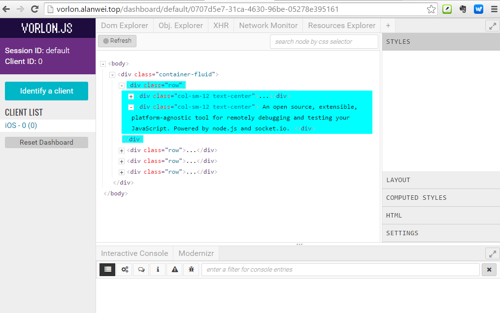
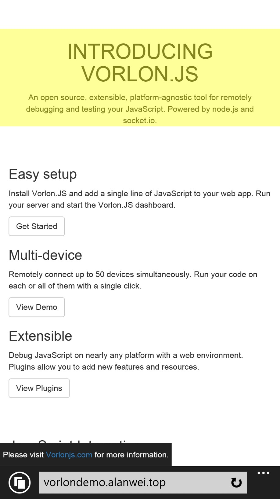
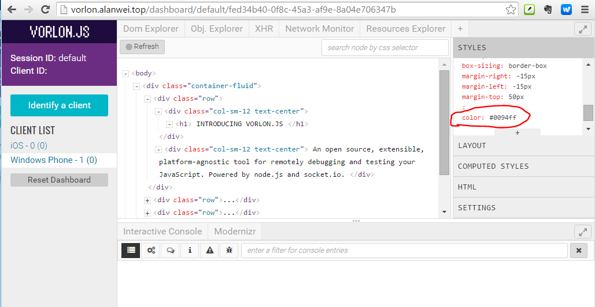
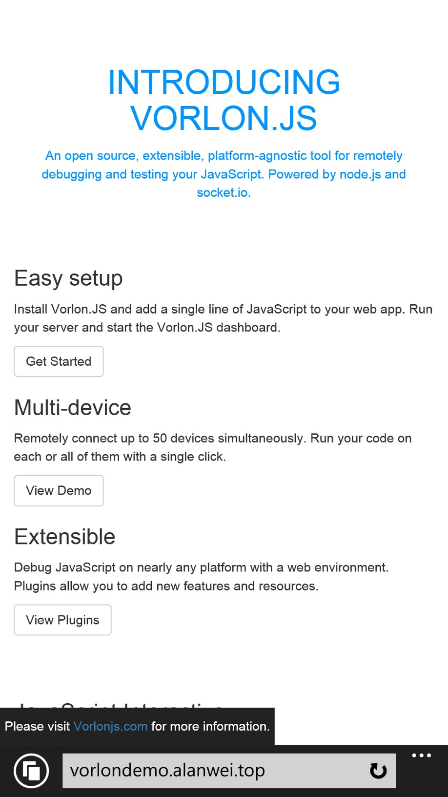
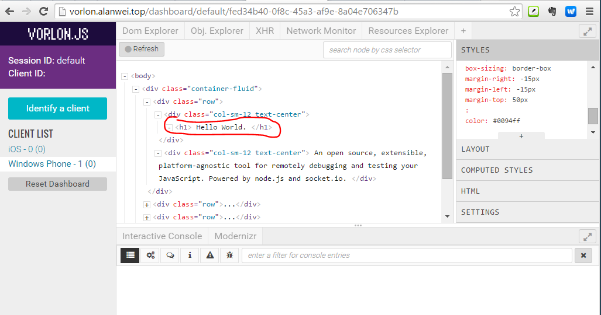
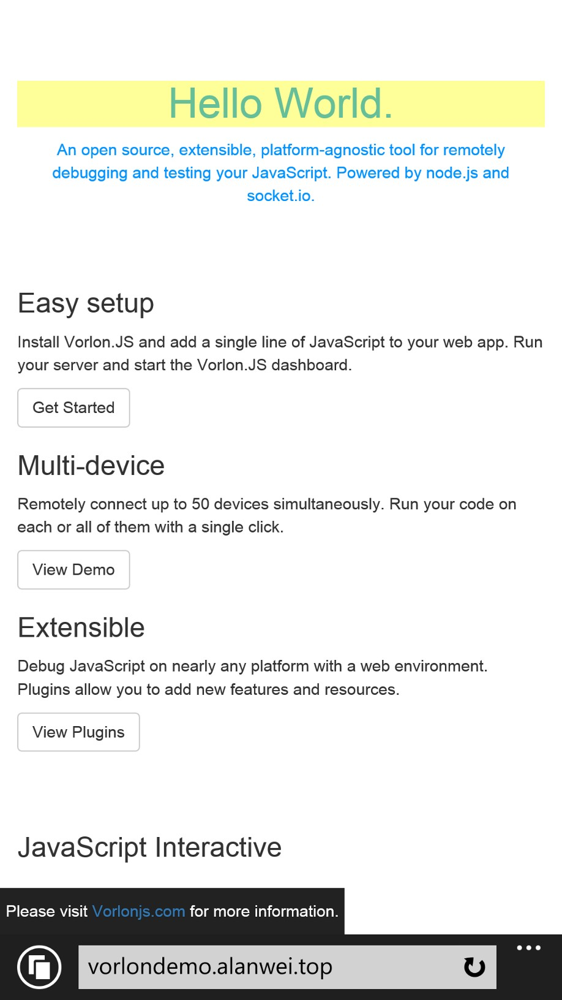
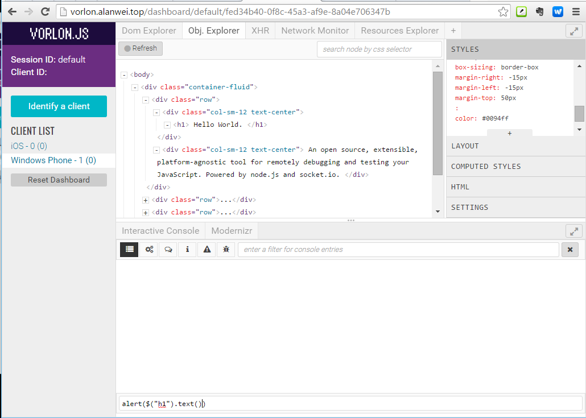
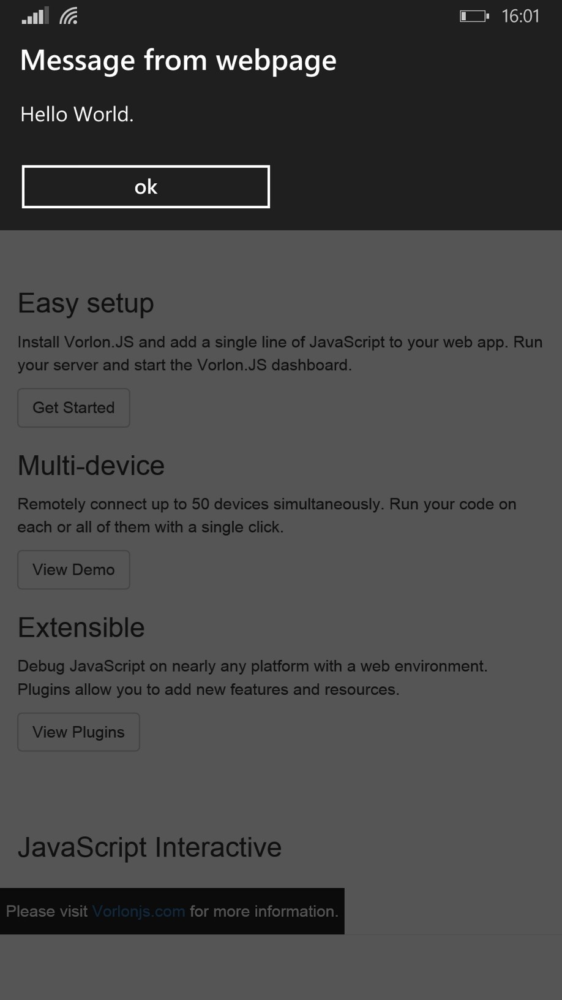
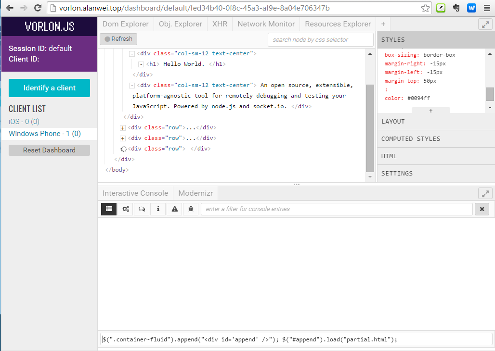
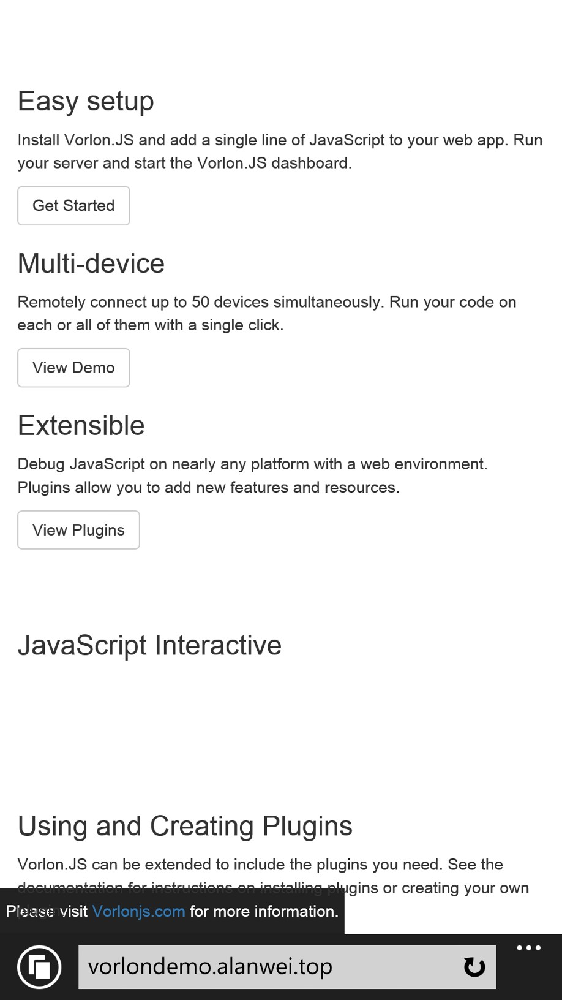

# Vorlonjs 简介 

[官网](http://www.vorlonjs.com)

## 使用
如果你想在本地自己动手搭建一个VorlonJS, 可以参考官网提供的文档. 需要注意一点的是, 安装 vorlon 貌似需要python环境. 
当然了自己搭一个要装软件, 还有配置网络, 如果完全从头来需要折腾一番. 现在你只需要在你的网页引用一个外部JavaScript文件就可以了(这是我在AWS上搭建的一个环境), 如下

	
	
最好放在头部, 尽早加载.
之后在移动端打开你的网页, 再在PC端打开 `http://vorlon.alanwei.top` 就可以看到你的设备了.

## 特性
[引用](http://www.vorlonjs.com/plugins/)

1. Console: 能够查看应用的log和errors
2. Modernizr: 查看用户代理(一般只用户浏览器)支持和未支持的(HTML/CSS/JavaScript)特性.
3. DOM Explorer: 能够审查DOM树, 并修改样式和内容.
4. Object Explorer: 显示正在存活的JavaScript变量树.
5. XHR Panel: 查看设备发送的Ajax信息.
6. ngInspector: 这个和AngularJS有关的信息.
7. Network Monitor: 查看网络活动(包括XHR和资源请求).
8. Resources Explorer: 资源浏览, 审查本地资源, 比如本地存储.

上述就是 VorlonJS 内置默认提供的几个功能, 是不是和Chrome等浏览器提供的开发者工具的模块一一对应? 看起来很强大, 实际实践时, 有些功能不那么好使.

## 演示
在手机浏览器上打开 http://vorlondemo.alanwei.top, PC浏览器上打开 http://vorlon.alanwei.top .
然后在PC浏览左侧的 `CLIENT LIST` 中选中你的设备.

右侧是的功能区, 刚才提到的功能都在右侧出现了.

#### 展开DOM, 鼠标放在元素上时, 手机端对应的元素会高亮显示.

### 右侧有 `STYLES`, 可以动态修改样式. (将文本颜色修改为 #0094ff)

#### 可以修改DOM中的文本. (将文本修改为 Hello World.)

#### 下面有个 `Interactive Console` 面板, 是用于输入JavaScript, 然后再移动端运行的. (这里在手机端弹一个框.)

#### 你甚至还可以调用ajax请求然后修改页面. (在控制台输入ajax请求服务器的partial.html并填充到页面底部.)

#### 你也可以右击HTML标签修改.
