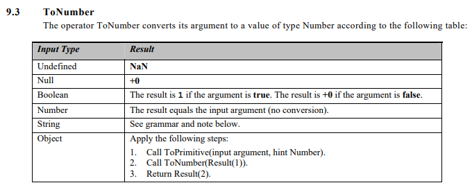

# 你不知道的JS(中)

## 2 值
### 2.1 数组

数组通过数字进行索引,但有趣的是它们也是对象,所以也可以包含字符串键值和属性 (但这些并不计算在数组长度内):
```javascript
var a = [ ];
a[0] = 1;
a["foobar"] = 2;
a.length;       // 1 
a["foobar"];    // 2 
a.foobar;       // 2
```
这里有个问题需要特别注意,如果字符串键值能够被强制类型转换为十进制数字的话,它就会被当作数字索引来处理. 
```javascript
var a = [ ];
a["13"] = 42;
a.length;   // 14
```
在数组中加入字符串键值/属性并不是一个好主意. 建议使用对象来存放键值/属性值,用数组来存放数字索引值. 

#### 类数组
有时需要将类数组(一组通过数字索引的值)转换为真正的数组，这一般通过数组工具函数(如 `indexOf(..)`、`concat(..)`、`forEach(..)` 等)来实现。
例如，一些 DOM 查询操作会返回 DOM 元素列表，它们并非真正意义上的数组，但十分类似。另一个例子是通过 `arguments` 对象(类数组)将函数的参数当作列表来访问(从 ES6 开始已废止)。
工具函数 `slice(..)` 经常被用于这类转换:
```javascript
function foo() {
    var arr = Array.prototype.slice.call( arguments );
    arr.push( "bam" );
    console.log( arr );
}
foo( "bar", "baz" ); // ["bar","baz","bam"]
```
如上所示，`slice()` 返回参数列表(上例中是一个类数组)的一个数组复本。 用 ES6 中的内置工具函数 `Array.from(..)` 也能实现同样的功能
```javascript
Array.from("alan")  // [ 'a', 'l', 'a', 'n' ]
```

### 2.2 字符串

数组的很多函数，字符串可以借用: 
```javascript
var a = "foo";
a.join;         // undefined
a.map;          // undefined
Array.prototype.join.call( a, "-" );    // "f-o-o"
Array.prototype.map.call( a, function(v){
    return v.toUpperCase() + ".";
} ).join( "" ); // "F.O.O."
```
因为字符串是不可变对象，所以改变数组原始值的函数，在字符串上操作没有效果，比如`reverse`:
```javascript
var a = "foo";
Array.prototype.reserve.call(a);
a //foo
```
字符串不可变是指字符串的成员函数不会改变其原始值，而是创建并返回一个新的字符串。而数组的成员函数都是在其原始值上进行操作. 

### 数字

小数点后小数部分最后面的 0 也可以省略, 所以以下都是合法声明: 
```javascript
var a = 42.0;
var b = 42.;
```
因为`.`它是一个有效的数字字符，会被优先识别为数字常量的一部分，然后才是对象属性访问运算符。所以:
```javascript
// 无效语法:
42.toFixed( 3 ); // SyntaxError
// 下面的语法都有效: 
(42).toFixed( 3 ); // "42.000" 
0.42.toFixed( 3 ); // "0.420" 
42..toFixed( 3 ); // "42.000"
```

`tofixed(..)` 方法可指定小数部分的显示位数，如果指定的小数部分的显示位数多于实际位数就用 0 补齐，函数返回结果是字符串。toPrecision(..) 方法用来指定有效数位的显示位数:
```javascript
var a = 42.59;
a.toPrecision( 1 ); // "4e+1"
a.toPrecision( 2 ); // "43"
a.toPrecision( 3 ); // "42.6"
a.toPrecision( 4 ); // "42.59"
a.toPrecision( 5 ); // "42.590"
a.toPrecision( 6 ); // "42.5900"
```
#### 较小的数值
所有遵循 IEEE 754 规范的语言都无法精确表示二进制浮点数中的 0.1 和 0.2，它们相加的结果并非刚好等于 0.3，而是一个比较接近的数字 0.30000000000000004。
那么应该怎样来判断 0.1 + 0.2 和 0.3 是否相等呢? 最常见的方法是设置一个误差范围值，通常称为“机器精度”(machine epsilon)，对 JavaScript 的数字来说，这个值通常是 `2^-52 (2.220446049250313e-16)`。 从 ES6 开始，该值定义在 `Number.EPSILON` 中，我们可以直接拿来用，也可以为 ES6 之前
的版本写 polyfill:
```javascript
if (!Number.EPSILON) {
    Number.EPSILON = Math.pow(2,-52);
}
```
可以使用 Number.EPSILON 来比较两个数字是否相等(在指定的误差范围内):
```javascript
function numbersCloseEnoughToEqual(n1,n2) {
    return Math.abs( n1 - n2 ) < Number.EPSILON;
}
var a = 0.1 + 0.2;
var b = 0.3;
numbersCloseEnoughToEqual( a, b );
numbersCloseEnoughToEqual( 0.0000001, 0.0000002 );  // false
```

#### 整数检测

要检测一个值是否是整数，可以使用 ES6 中的 `Number.isInteger(..)` 方法:
```javascript
Number.isInteger( 42 );     // true
Number.isInteger( 42.000 ); // true
Number.isInteger( 42.3 );   // false
```
也可以为 ES6 之前的版本 polyfill `Number.isInteger(..)` 方法:
```javascript
if (!Number.isInteger) {
    Number.isInteger = function(num) {
        return typeof num == "number" && num % 1 == 0;
    };
}
```
要检测一个值是否是安全的整数，可以使用 ES6 中的 `Number.isSafeInteger(..)` 方法:
```javascript
Number.isSafeInteger( Number.MAX_SAFE_INTEGER );    // true
Number.isSafeInteger( Math.pow( 2, 53 ) );  // false
Number.isSafeInteger( Math.pow( 2, 53 ) - 1 );  // true
```
可以为 ES6 之前的版本 polyfill `Number.isSafeInteger(..)` 方法:
```javascript
if (!Number.isSafeInteger) {
    Number.isSafeInteger = function(num) {
        return Number.isInteger( num ) &&
        Math.abs( num ) <= Number.MAX_SAFE_INTEGER;
    }; 
}
```
#### 不是值的值

`null` 是一个特殊关键字，不是标识符，我们不能将其当作变量来使用和赋值。然而 `undefined` 却是一个标识符，可以被当作变量来使用和赋值。

#### NaN

`isNaN` 会对输入参数进行类型转换(`ToNumber`), 然后再判断是否是 `NaN`, `ToNumber`转换规则参考ECMA规范: 


```javascript
isNaN(NaN)          // true
isNaN(undefined)    // true, 因为 ToNumber(underfined) => NaN
isNaN(0)            // false
isNaN(null)         // false, 因为 ToNumber(null) => 0
```

`Number.isNaN` 会判断输入参数是否是`number`类型, 等同于如下代码:

```javascript
if (!Number.isNaN) {
    Number.isNaN = function(n) {
        return (typeof n === "number" && window.isNaN( n ) );
    };
} 

// OR

if (!Number.isNaN) {
    Number.isNaN = function(n) {
        return n !== n;
    };
}
```

# Progress

* 2018-12-09 P20,41