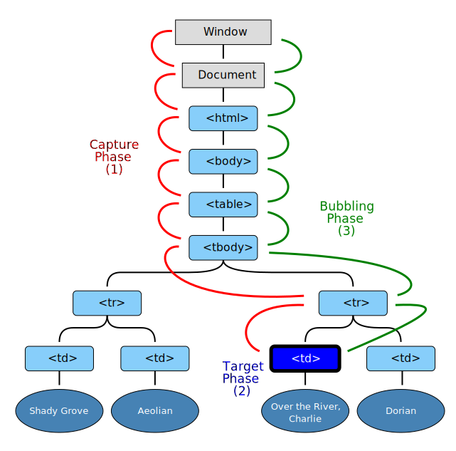

# 现代 JavaScript 教程

Ref: [现代 JavaScript 教程](https://zh.javascript.info/)

## 浏览器事件简介

常用 DOM 事件的列表: 

鼠标事件：
* click —— 当鼠标点击一个元素时（触摸屏设备会在点击时生成）。
* contextmenu —— 当鼠标右键点击一个元素时。
* mouseover / mouseout —— 当鼠标指针移入/离开一个元素时。
* mousedown / mouseup —— 当在元素上按下/释放鼠标按钮时。
* mousemove —— 当鼠标移动时。

表单（form）元素事件：
* submit —— 当访问者提交了一个 `<form>` 时。
* focus —— 当访问者聚焦于一个元素时，例如聚焦于一个 `<input>`。

键盘事件：
* keydown 和 keyup —— 当访问者按下然后松开按键时。

Document 事件：
* DOMContentLoaded —— 当 HTML 的加载和处理均完成，DOM 被完全构建完成时。

CSS 事件：
* transitionend —— 当一个 CSS 动画完成时。

## 事件处理程器

事件的处理程序可以设置在 HTML 中名为 `on<event>` 的特性（attribute）中, HTML 特性名是大小写不敏感的，所以 ONCLICK 和 onClick 以及 onCLICK 都一样可以运行:

```html
<input type="button" onclick="countRabbits()" value="Count rabbits!">
<!-- or -->
<input type="button" onclick="alert('ok')" value="Count rabbits!">
```

也可以使用DOM属性（property）`on<event>` 来分配处理程序, DOM属性是大小写敏感的.

```html
<!-- 正确 -->
<input type="button" id="button" onclick="sayThanks()">

<!-- 错误 -->
<input type="button" id="button" onclick="sayThanks">

<script>
// 正确
button.onclick = sayThanks;

// 错误
button.onclick = sayThanks();
button.onClick = sayThanks();
</script>
```

当浏览器读取 HTML 特性（attribute）时，浏览器将会使用 特性中的内容 创建一个处理程序: 
```html
<input type="button" id="button" onclick="alert(event.tagName); return sayThanks();">
```
上面的HTML的`onclick`处理程序会被转换成:
```javascript
button.onclick = function(event) {
  alert(event.tagName);
  return sayThanks(); 
};
```

不要对处理程序使用 `setAttribute`, 这样的调用会失效:
```javascript
// 点击 <body> 将产生 error，
// 因为特性总是字符串的，函数变成了一个字符串
document.body.setAttribute('onclick', function() { alert(1) });
```

添加多个事件处理程序
```
element.addEventListener(event, handler[, options]);
```

* event 事件名，例如："click"。
* handler 处理程序。
* options 配置
    * once：如果为 true，那么会在被触发后自动删除监听器。
    * capture：默认false, 事件处理的阶段. 由于历史原因，options 也可以是 false/true，它与 {capture: false/true} 相同。 
    * passive：如果为 true，那么处理程序将不会 preventDefault()

要移除处理程序，我们需要传入与分配的函数完全相同的函数。

对于某些事件，只能通过 `addEventListener` 设置处理程序, 比如: `DOMContentLoaded`.

## 冒泡和捕获

几乎所有事件都会冒泡, `focus` 事件不会冒泡.

* event.type 事件类型
* event.currentTarget 处理事件的元素
* event.clientX / event.clientY 鼠标事件的指针的窗口相对坐标
* event.stopPropagation() 停止向上冒泡, 该元素上的其他处理程序仍会执行.
* event.stopImmediatePropagation() 可以用于停止冒泡，并阻止当前元素上的处理程序运行。使用该方法之后，其他处理程序就不会被执行。
* event.eventPhase 当前阶段（capturing=1，target=2，bubbling=3）
* event.isTrusted 对于来自真实用户操作的事件，event.isTrusted 属性为 true，对于脚本生成的事件，event.isTrusted 属性为 false。

DOM 事件标准描述了事件传播的 3 个阶段：
* 捕获阶段（Capturing phase）—— 事件（从 Window）向下走近元素。
* 目标阶段（Target phase）—— 事件到达目标元素。
* 冒泡阶段（Bubbling phase）—— 事件从元素上开始冒泡。

下面是在表格中点击 `<td>` 的图片，摘自规范：

<object type="image/svg+xml" data="../files/eventflow.svg" class="image__image" width="641" height="633">  </object>

当我们将事件处理程序分配给 `document` 对象时，我们应该始终使用 `addEventListener`，而不是 `document.on<event>`，因为后者会引起冲突：新的处理程序会覆盖旧的处理程序。

### 浏览器默认行为

有两种方式来告诉浏览器我们不希望它执行默认行为：
* 主流的方式是使用 event 对象。有一个 `event.preventDefault()` 方法。
* 如果处理程序是使用 `on<event>`（而不是 `addEventListener`）分配的，那返回 false 也同样有效。

在下面这个示例中，点击链接不会触发导航（navigation），浏览器不会执行任何操作：

```html
<a href="/" onclick="return false">Click here</a>
<a href="/" onclick="event.preventDefault()">Click here</a>
```

上述HTML的事件处理程序实际会包含在function体内部, 转换成如下代码执行:
```js
// return false
function(event){
    return false;
}

// event.preventDefault()
function (event){
    event.preventDefault();
}
```

所以注意以下代码:
```html
<!-- 点击链接会跳转到 / -->
<a href="/" onclick="clickme()">Click here</a> 

<!-- 这么写才可以阻止默认行为 -->
<a href="/" onclick="return clickme()">Click here</a> 

<script>
function clickme(){
    return false;
}
</script>
```

事件处理程序返回的值通常会被忽略, 唯一的例外是从使用 `on<event>` 分配的处理程序中返回的 `return false`. 在所有其他情况下，`return` 值都会被忽略。并且，返回 `true` 没有意义。


某些事件会相互转化。如果我们阻止了第一个事件，那就没有第二个事件了。 例如，在 `<input>` 字段上的 `mousedown` 会导致在其中获得焦点，以及 `focus` 事件。如果我们阻止 `mousedown` 事件，在这就没有焦点了。 尝试点击下面的第一个 `<input>` —— 会发生 `focus` 事件。但是如果你点击第二个，则没有聚焦。
```html
<input value="Focus works" onfocus="this.value=''">
<input onmousedown="return false" onfocus="this.value=''" value="Click me">
```
点击第一个input表单先触发`mousedown`事件, 然后触发`focus`, 文本框的内容被清空了. 点击第二个文本框因为`mousedown`事件被阻止了, `focus`事件就不会触发, 文本框内容不会变化. 但是如果使用键盘的tab按键切换可以使第二个input直接触发focus事件, 文本框内容也就被清空了.


`addEventListener`的可选项 `passive: true` 向浏览器发出信号，表明处理程序将不会调用 `preventDefault()`。 为什么需要这样做？ 移动设备上会发生一些事件，例如 `touchmove`（当用户在屏幕上移动手指时），默认情况下会导致滚动，但是可以使用处理程序的 `preventDefault()` 来阻止滚动。 因此，当浏览器检测到此类事件时，它必须首先处理所有处理程序，然后如果没有任何地方调用 `preventDefault` ，则页面可以继续滚动。但这可能会导致 UI 中不必要的延迟和抖动。 `passive: true` 选项高速浏览器，处理程序不会取消滚动。然后浏览器立即滚动页面以提供最大程度的流畅体验，并通过某种方式处理事件。 对于某些浏览器（Firefox，Chrome），默认情况下， `touchstart` 和 `touchmove` 事件的 `passive` 为 `true`。 


如果默认行为被阻止(执行了 `event.preventDefault()`)，那么 `event.defaultPrevented` 属性为 `true` ，否则为 `false` 。可用于事件委托种判断事件在之前的处理中执行了 `event.preventDefault()`.


## 创建自定义事件

我们可以像这样创建 Event 对象 `let event = new Event(type[, options]);` 

* type —— 事件类型，可以是像这样 "click" 的字符串，或者我们自己的像这样 "my-event" 的参数。
* options —— 具有两个可选属性的对象, 默认情况下: {bubbles: false, cancelable: false}。
    * bubbles: true/false —— 如果为 true，那么事件会冒泡。
    * cancelable: true/false —— 如果为 true，那么“默认行为”就会被阻止。
    
事件对象被创建后，我们应该使用 `elem.dispatchEvent(event)` 触发元素elem上绑定的事件. 对于来自真实用户操作的事件，event.isTrusted 属性为 true，对于脚本生成的事件，event.isTrusted 属性为 false。

如果我们想要创建浏览器内置的事件, 比如 click 事件, 我们应该使用 `MouseEvent` 而不是 `new Event`, 因为正确的事件类型允许额外传递`Event`无法传递的事件数据:
```js
let event = new MouseEvent("click", {
  bubbles: true,
  cancelable: true,
  clientX: 100,
  clientY: 100
});

alert(event.clientX); // 100

// 下面这种就不行
let event = new Event("click", {
  bubbles: true, // 构造器 Event 中只有 bubbles 和 cancelable 可以工作
  cancelable: true,
  clientX: 100,
  clientY: 100
});

alert(event.clientX); // undefined，未知的属性被忽略了！
/**
 * 从技术上讲，我们可以通过在创建后直接分配 event.clientX=100 来解决这个问题。所以，这是一个方便和遵守规则的问题。
 * 浏览器生成的事件始终具有正确的类型。
 */ 
```


对于我们自己的全新事件类型，例如 "hello"，我们应该使用 `new CustomEvent`。从技术上讲，`CustomEvent` 和 `Event` 一样。除了一点不同: 在第二个参数（对象）中，我们可以为我们想要与事件一起传递的任何自定义信息添加一个附加的属性 `detail`, `detail` 属性可以有任何数据:
```html
<h1 id="elem">Hello for John!</h1>

<script>
  // 事件附带给处理程序的其他详细信息
  elem.addEventListener("hello", function(event) {
    alert(event.detail.name);
  });

  elem.dispatchEvent(new CustomEvent("hello", {
    detail: { name: "John" }
  }));
</script>
```


许多浏览器事件都有“默认行为”，例如，导航到链接，开始一个选择等。 对于新的，自定义的事件，绝对没有默认的浏览器行为，但是分派（dispatch）此类事件的代码可能有自己的计划，触发该事件之后应该做什么。 通过调用 `event.preventDefault()`，事件处理程序可以发出一个信号，指出这些行为应该被取消。 在这种情况下，`elem.dispatchEvent(event)` 的调用会返回 `false`。那么分派（dispatch）该事件的代码就会知道不应该再继续。 让我们看一个实际的例子, 任何处理程序都可以使用 `rabbit.addEventListener('hide',...)` 来监听该事件，并在需要时使用 `event.preventDefault()` 来取消该行为。然后兔子就不会藏起来了: 
```html
<pre id="rabbit">
  |\   /|
   \|_|/
   /. .\
  =\_Y_/=
   {>o<}
</pre>
<button onclick="hide()">Hide()</button>

<script>
  function hide() {
    let event = new CustomEvent("hide", {
      cancelable: true // 没有这个标志，preventDefault 将不起作用
    });
    if (!rabbit.dispatchEvent(event)) {
      alert('The action was prevented by a handler');
    } else {
      rabbit.hidden = true;
    }
  }

  rabbit.addEventListener('hide', function(event) {
    if (confirm("Call preventDefault?")) {
      event.preventDefault();
    }
  });
</script>
```
> 请注意：该事件必须具有 `cancelable: true` 标志，否则 `event.preventDefault()` 调用将会被忽略。


通常事件是被异步处理的。也就是说：如果浏览器正在处理 `onclick`，在此处理过程中发生了一个新的事件，那么它将等待，直到 `onclick` 处理完成。 唯一的例外就是，一个事件是在另一个事件中发起的。 然后，程序执行的控制流会跳转到嵌套的事件的处理程序，执行完成后返回。 例如，这里的嵌套事件 `menu-open` 在 `onclick` 期间被同步处理：
```html
<button id="menu">Menu (click me)</button>

<script>
  menu.onclick = function() {
    alert(1);

    menu.dispatchEvent(new CustomEvent("menu-open", {
      bubbles: true
    }));

    alert(2);
  };

  document.addEventListener('menu-open', () => alert('nested'));

  // 输出顺序为：1 → nested → 2
</script>
```
请注意，嵌套事件 menu-open 会完全冒泡，并在 `document` 上被处理。嵌套事件的传播（propagation）和处理必须完全完成，然后处理过程才会返回到外部代码（`onclick`）。 这不仅与 `dispatchEvent` 有关，还有其他情况。事件处理程序中的代码可以调用会引发其他事件的方法 -- 它们也是被同步处理的。 如果我们不喜欢它，可以将 `dispatchEvent`（或者其他触发事件的调用）放在 `onclick` 末尾，或者最好将其包装到零延迟的 `setTimeout` 中.