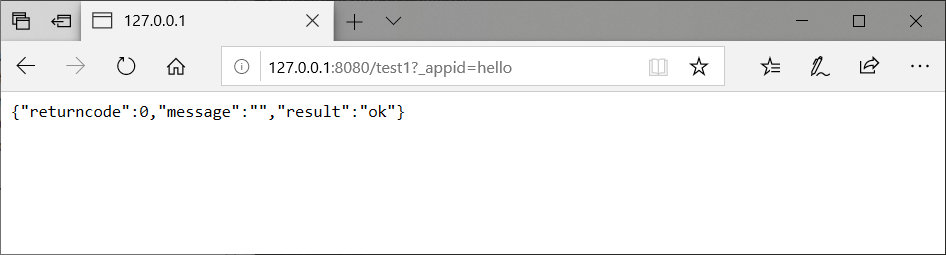
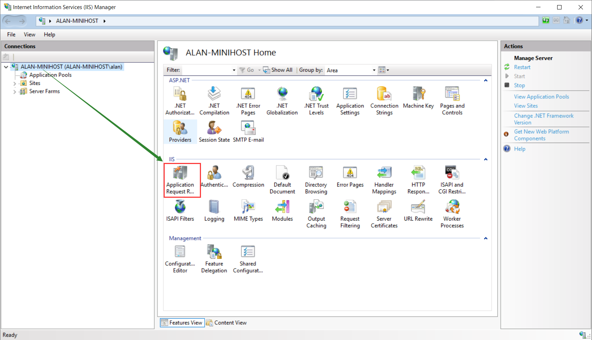
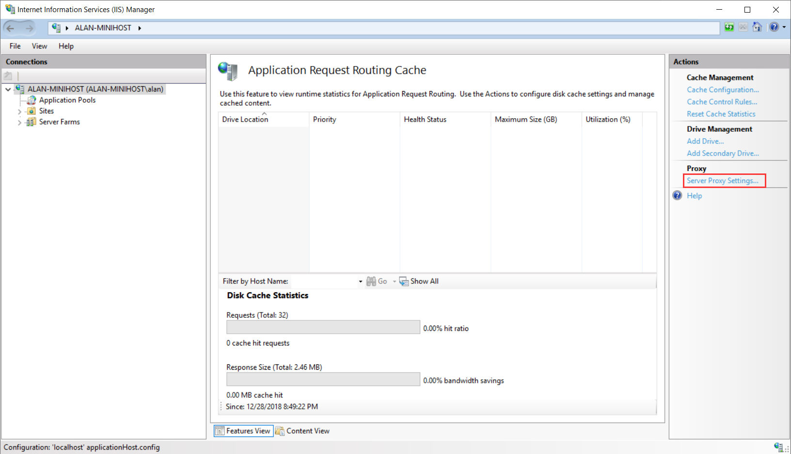
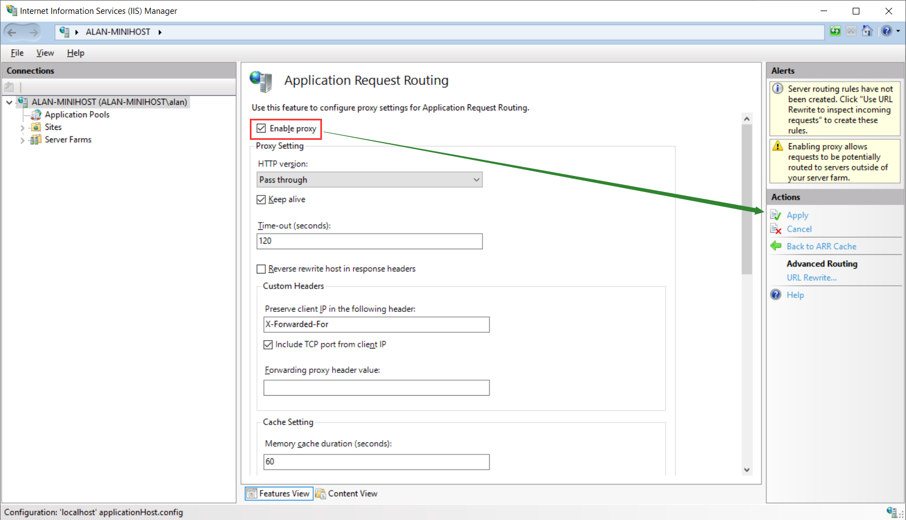
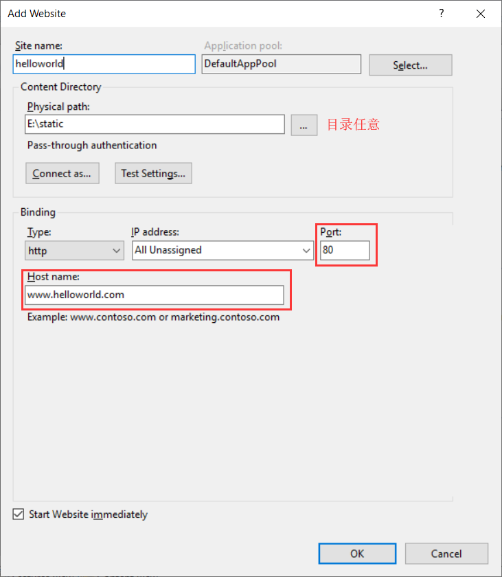
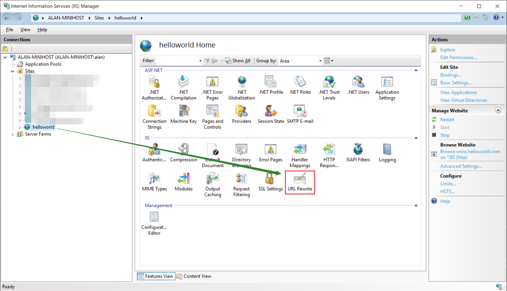
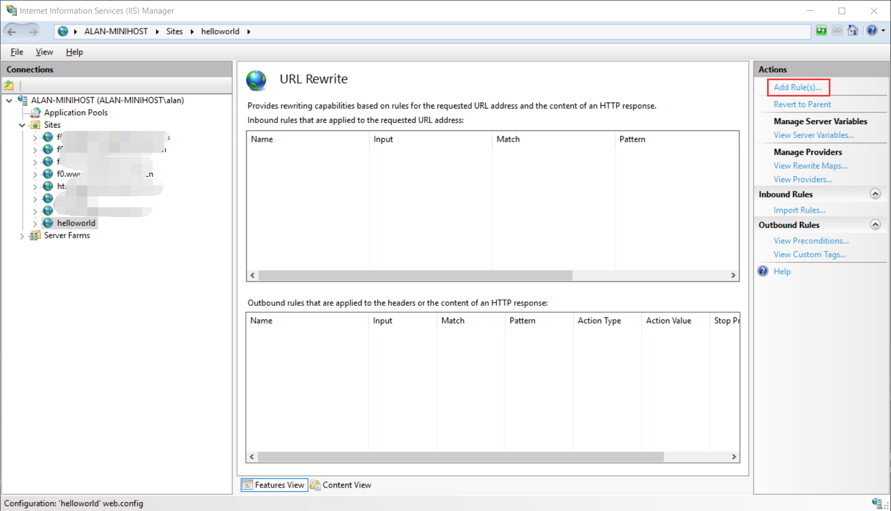
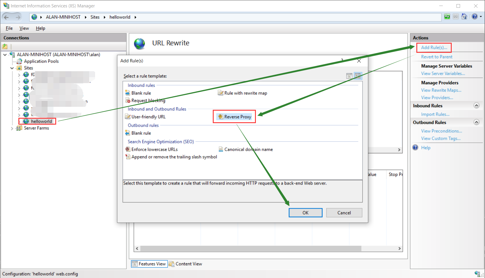
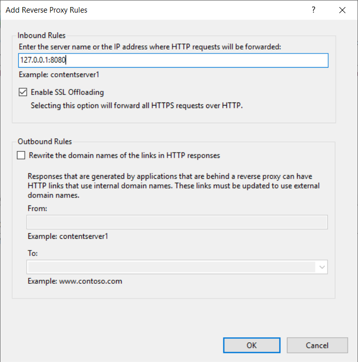
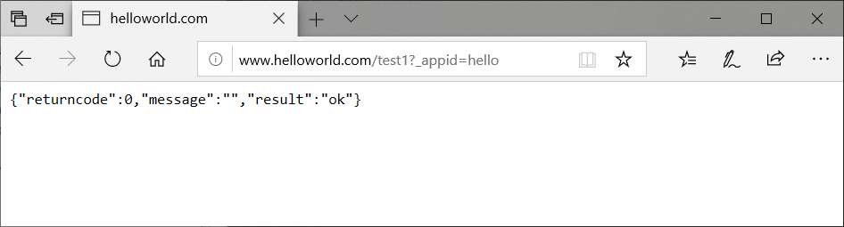

# IIS 代理设置

假设将域名`www.helloworld.com`代理到本地的`8080`端口

## 准备

* 安装IIS
* 安装 [http://www.iis.net/downloads/microsoft/url-rewrite](../Resources/IIS_ARR_requestRouter_amd64.msi)
* 安装 [https://www.iis.net/downloads/microsoft/application-request-routing](../Resources/IIS_URL_Rewriter_rewrite_amd64_en-US.msi)
* 在`hosts`文件增加 `127.0.0.1 www.helloworld.com`

## 设置

设置前: 

开启ARR代理:

新建一个站点`helloworld`(站点名称随意), 并绑定域名`www.helloworld.com`:

配置`helloworld`站点的URL Rewrite:

配置完成之后访问 `www.helloworld.com` 实际上访问的是IIS的站点`helloworld`, 然后IIS会将请求路由到`127.0.0.1:8080`, 看到的效果如下: 

