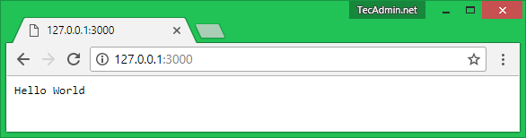
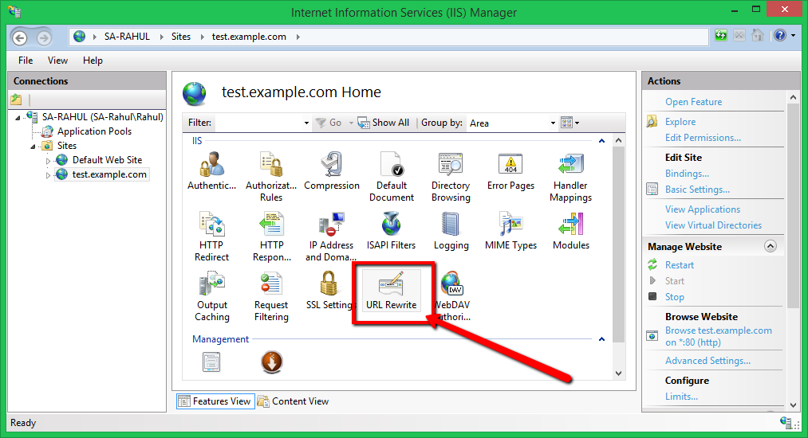
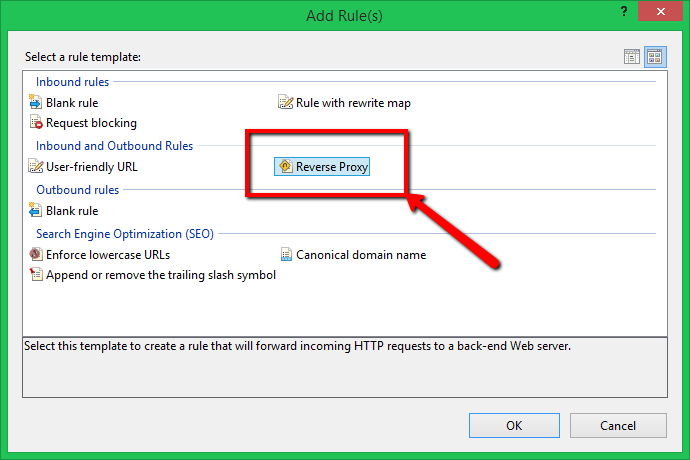
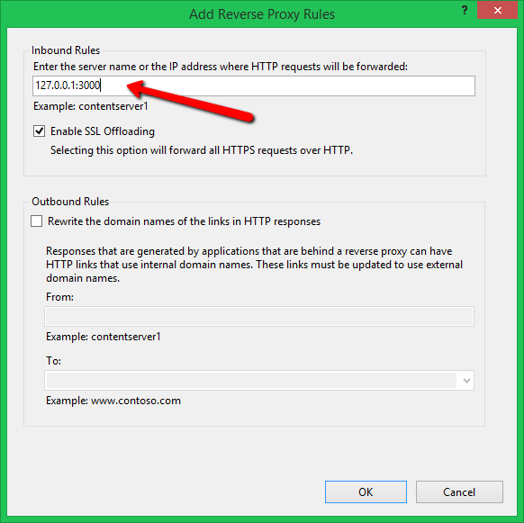
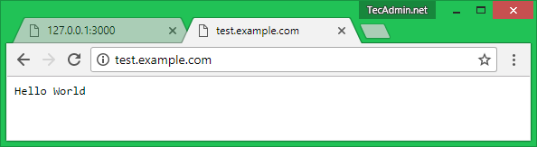

# How to Setup Reverse Proxy on IIS with URL-Rewrite

[原文](https://tecadmin.net/set-up-reverse-proxy-using-iis/)

Most of the system administrator is aware of the reverse proxy. It is a type of proxy server which fetches the resources from one or more computers on clients requests and send back to the client. In simple terms, it works as an intermediate server, which listens to clients query. Then requests to server bases of clients query and returns results to client sent by the server. This tutorial will help you to setup reverse proxy using IIS with URL rewrite and application request routing extension.

We can configure reverse proxy in IIS using URL Rewrite module. This is similar to the mod_rewrite module in Apache. Before starting work make sure you have installed and enabled URL Rewrite module in IIS server.

## What is URL Rewrite Module?

URL Rewrite Module is officially provided by IIS development tool to extend the functionality of IIS web server. It provides additional functionality to rewrite application URL. This helps to make clean and SEO friendly URLs.

You can visit below URL and download and install URL rewrite IIS extension:

[http://www.iis.net/downloads/microsoft/url-rewrite](../Resources/IIS_ARR_requestRouter_amd64.msi)

You also need Application Request Routing extension to install on your system. Visit the following URL to download the extension and install on your system.

[https://www.iis.net/downloads/microsoft/application-request-routing](../Resources/IIS_URL_Rewriter_rewrite_amd64_en-US)

For more details, visit our other article here.

## Set Up Reverse Proxy Using IIS

Let’s start with the configuration of the reverse proxy. For this tutorial, I have created a dummy web application running on port 3000 using node.js. You can see the below screenshot of the web application.

Now, open the IIS by typing “inetmgr” in run window. Select your website under sites in left side section. Now select “URL Rewrite” option.

Now click on “Add Rule(s)…” in actions section on the right side. See below screenshot for this link.

Now select Reverse Proxy under inbound and outbound section.

The above option will open a window, Add the server name or IP address with port under inbound rules input box. This is the URL from where reverse proxy will server data on clients request.

At this point, the reverse proxy setup has been done. Now access web site configured with IIS. You will see the backend application is accessible here. This is the reverse proxy in working.

This is the reverse proxy in working.