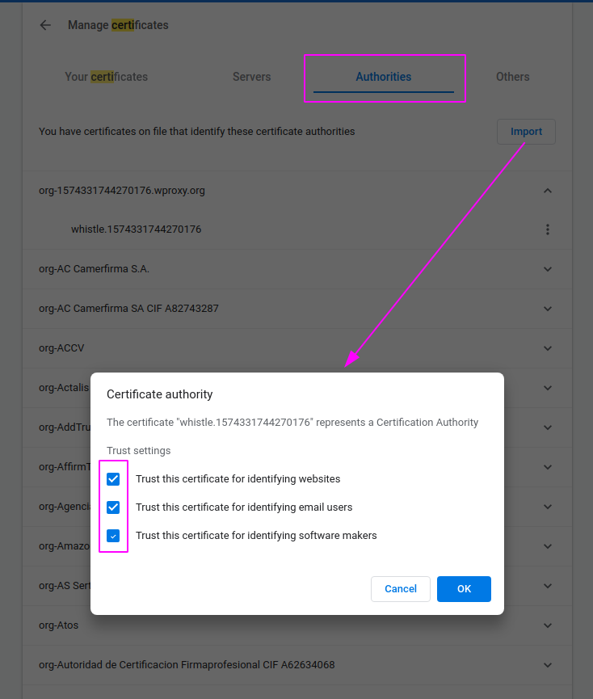
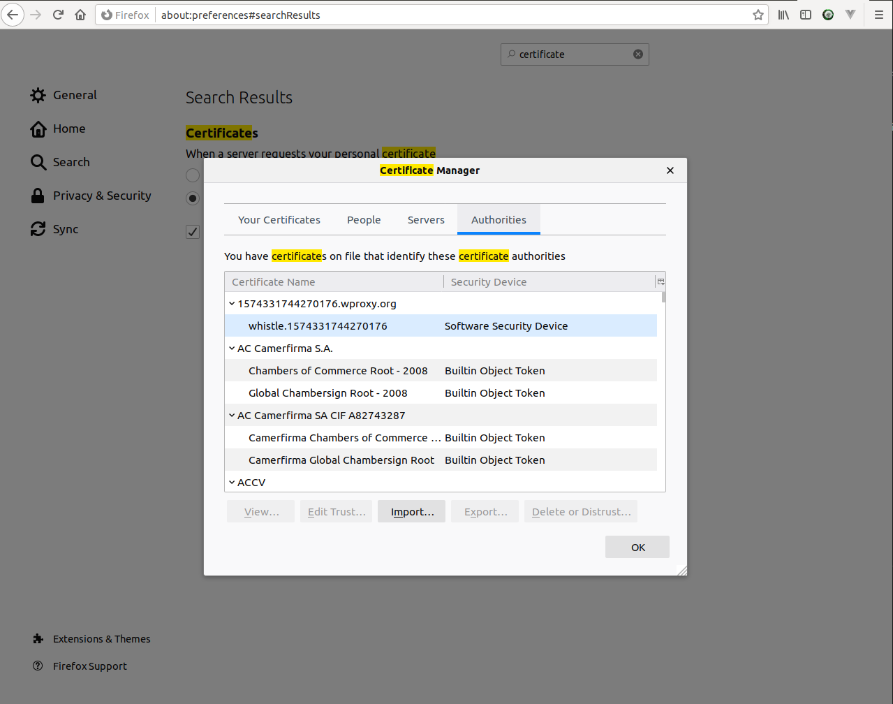

# Firefox/Chrome 安装CA证书

## Chrome

访问 `chrome://settings/certificates` , 切换到 `Authorities` Tab, 然后点击 __Import__, 选择CA证书文件(.crt格式), 把所有checkbox勾选了, 确认即可

## Firefox

打开设置, 搜索 `certificate`, 点击 `View Certificates`, 切换到 `Authorities`, 点击 __Import__ 选择CA证书文件倒入即可.

